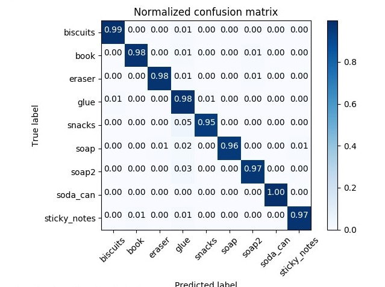
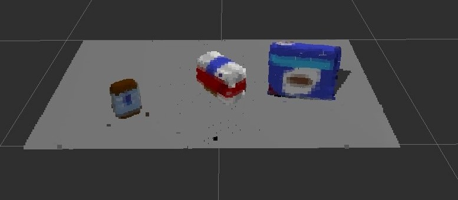
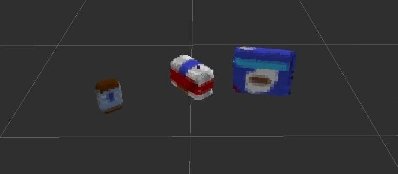
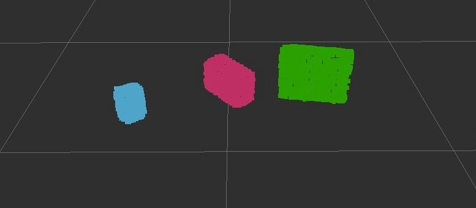
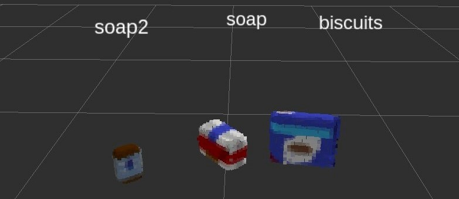
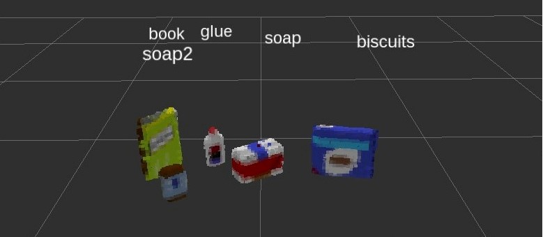
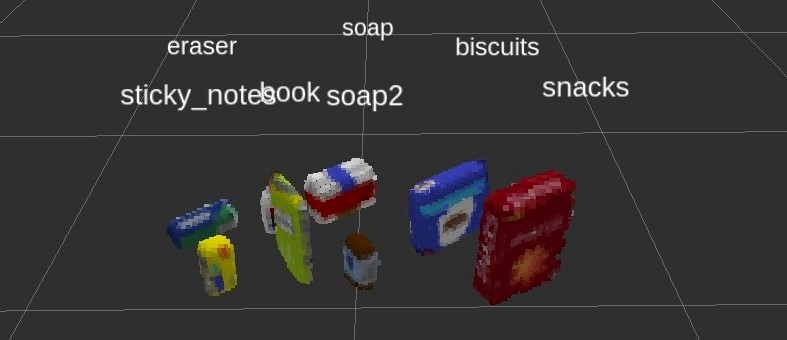

# Project: Perception Pick & Place

## Required Steps for a Passing Submission( `test1.world` )

1. ✅ Extract features and train an SVM model on new objects (see `pick_list_*.yaml` in `/pr2_robot/config/` for the list of models you'll be trying to identify).

    in `sensor_stick/scripts/capture_features.py` :

    ```py
    if __name__ == '__main__':
        rospy.init_node('capture_node')

        models = [\
            'biscuits',
            'book',
            'eraser',
            'glue',
            'snacks',
            'soap',
            'soap2',
            'soda_can',
            'sticky_notes',
        ]

    # defaut: max_sample_num = 5
    max_sample_num = 1000
    ```

    A snapshot of normalized confusion matrix:

    

    Results:

    ```text
    Features in Training Set: 9000
    Invalid Features in Training set: 17
    Scores: [ 0.97829716  0.9671675  0.98052309 0.97828508  0.97383073]
    Accuracy: 0.98 (+/- 0.01)
    accuracy score: 0.974841367027
    ```

2. ✅ Write a ROS node and subscribe to `/pr2/world/points` topic. This topic contains noisy point cloud data that you must work with.

    

3. ✅ Use filtering and RANSAC plane fitting to isolate the objects of interest from the rest of the scene.

    After `Statistical Filter` and `Downsampling filter`:

    

    After `RANSAC plane fitting`:

    

4. ✅ Apply Euclidean clustering to create separate clusters for individual items.

    After `Euclidean clustering`:

    

5. ✅ Perform object recognition on these objects and assign them labels (markers in RViz).

    Markers with labeled objects:

    

6. Calculate the centroid (average in x, y and z) of the set of points belonging to that each object.

    The code in the project:

    ```py
    def compute_centroid(cloud):
        """ Obtain cetoroid of Point Cloud """
        points = ros_to_pcl(cloud)
        np_points = np.mean(points, axis=0)[:3]
        return [ np.asscalar(x) for x in np_points]
    ```

    ```py
    # DONE: Assign the arm to be used for pick_place
    centroid = compute_centroid(detected.cloud)
    pick_place = Pose()
    pick_place.position.x = centroid[0]
    pick_place.position.y = centroid[1]
    pick_place.position.z = centroid[2]
    ```

7. ✅ Create ROS messages containing the details of each object (name, pick_pose, etc.) and write these messages out to `.yaml` files, one for each of the 3 scenarios (`test1-3.world` in `/pr2_robot/worlds/`).  [See the example `output.yaml` for details on what the output should look like.](https://github.com/udacity/RoboND-Perception-Project/blob/master/pr2_robot/config/output.yaml)

    Ex. (from [output_1.yaml] )

    ```yaml
    object_list:
        - arm_name: right
        object_name: biscuits
        pick_pose:
            orientation:
            w: 0.0
            x: 0.0
            y: 0.0
            z: 0.0
            position:
            x: 0.5419886708259583
            y: -0.24221235513687134
            z: 0.7056498527526855
        place_pose:
            orientation:
            w: 0.0
            x: 0.0
            y: 0.0
            z: 0.0
            position:
            x: 0
            y: -0.71
            z: 0.605
        test_scene_num: 1
        - arm_name: right
        object_name: soap

    : (snip snip)
    ```

8. ✅ Submit a link to your GitHub repo for the project or the Python code for your perception pipeline and your output `.yaml` files (3 `.yaml` files, one for each test world).  You must have correctly identified 100% of objects from `pick_list_1.yaml` for `test1.world`, 80% of items from `pick_list_2.yaml` for `test2.world` and 75% of items from `pick_list_3.yaml` in `test3.world`.

    Table of results:

    | World       | Result     | output yml      | note
    |-------------|------------|-----------------|-------
    | test1.world | 3/3=100%   | [output_1.yaml] |
    | test2.world | 5/5=100%   | [output_2.yaml] |
    | test3.world | 7/8=87.5%  | [output_3.yaml] | 7 objects detected

9. ✅ Congratulations!  Your Done!

### Pictures for `test2.world`

* [output_2.yaml]



### Pictures for `test3.world`

* [output_3.yaml]



> 📝 Couldn't detect the `glue` in `test3 world`.

## todo: Extra Challenges: Complete the Pick & Place

7. To create a collision map, publish a point cloud to the `/pr2/3d_map/points` topic and make sure you change the `point_cloud_topic` to `/pr2/3d_map/points` in `sensors.yaml` in the `/pr2_robot/config/` directory. This topic is read by Moveit!, which uses this point cloud input to generate a collision map, allowing the robot to plan its trajectory.  Keep in mind that later when you go to pick up an object, you must first remove it from this point cloud so it is removed from the collision map!
8. Rotate the robot to generate collision map of table sides. This can be accomplished by publishing joint angle value(in radians) to `/pr2/world_joint_controller/command`
9. Rotate the robot back to its original state.
10. Create a ROS Client for the “pick_place_routine” rosservice.  In the required steps above, you already created the messages you need to use this service. Checkout the [PickPlace.srv](https://github.com/udacity/RoboND-Perception-Project/tree/master/pr2_robot/srv) file to find out what arguments you must pass to this service.
11. If everything was done correctly, when you pass the appropriate messages to the `pick_place_routine` service, the selected arm will perform pick and place operation and display trajectory in the RViz window
12. Place all the objects from your pick list in their respective dropoff box and you have completed the challenge!
13. Looking for a bigger challenge?  Load up the `challenge.world` scenario and see if you can get your perception pipeline working there!

## [Rubric](https://review.udacity.com/#!/rubrics/1067/view) Points

### Here I will consider the rubric points individually and describe how I addressed each point in my implementation.  

---

### Writeup / README

#### 1. Provide a Writeup / README that includes all the rubric points and how you addressed each one.  You can submit your writeup as markdown or pdf.  

You're reading it!

### Exercise 1, 2 and 3 pipeline implemented

#### 1. Complete Exercise 1 steps. Pipeline for filtering and RANSAC plane fitting implemented.

* todo: picture
* todo: 🔗 Exercise 1 (other repository)

#### 2. Complete Exercise 2 steps: Pipeline including clustering for segmentation implemented.  

* todo: picture
* todo: 🔗 Exercise 2 (other repository)

#### 2. Complete Exercise 3 Steps.  Features extracted and SVM trained.  Object recognition implemented.
Here is an example of how to include an image in your writeup.

* todo: picture, SVM.
* todo: 🔗 Exercise 3 (other repository)

### Pick and Place Setup

Please, see above, `"Required Steps for a Passing Submission"`.

[output_1.yaml]: ./output_1.yaml
[output_2.yaml]: ./output_2.yaml
[output_3.yaml]: ./output_3.yaml